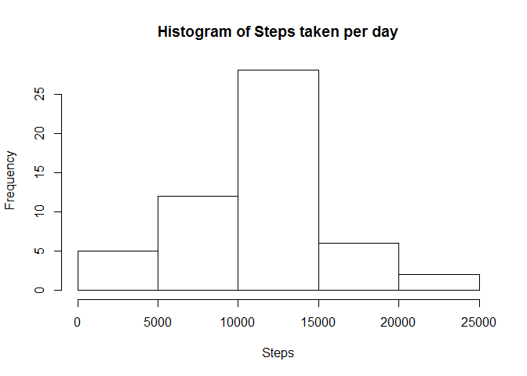
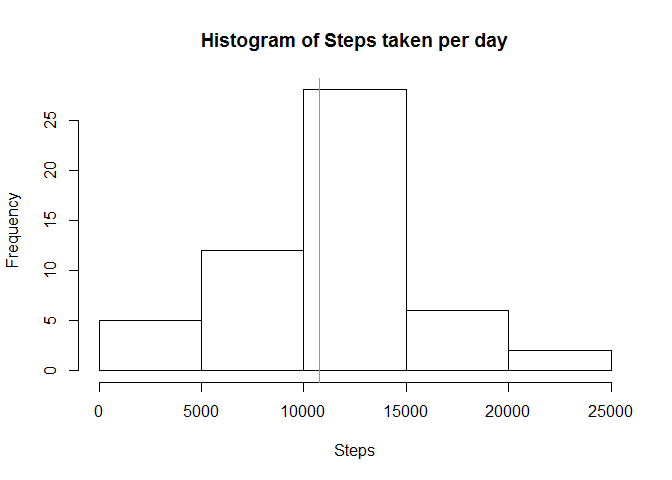
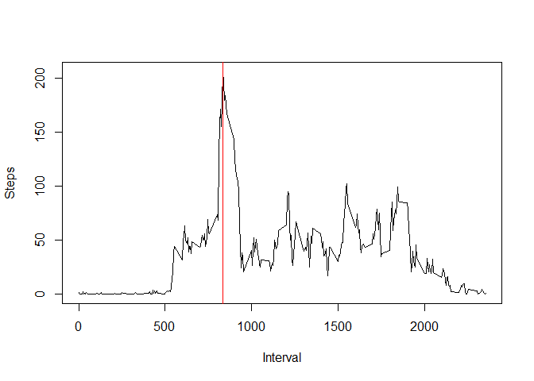
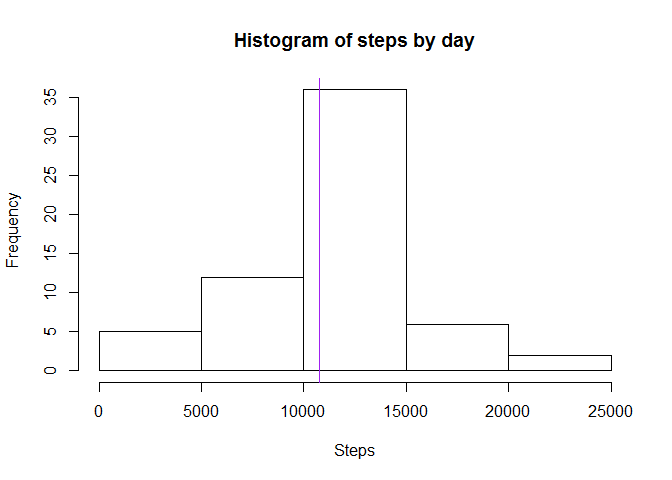
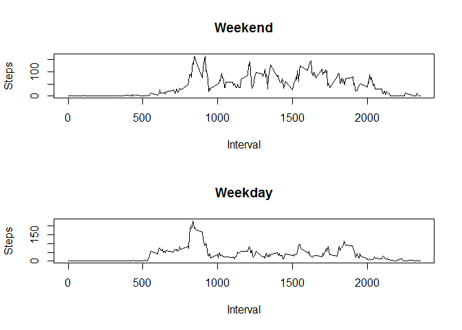

Loading and preprocessing the data
----------------------------------

1.  Unzip the datas in the working directory

<!-- -->

    unzip("activity.zip")

1.  Read the datas

<!-- -->

    data <- read.csv("activity.csv")

1.  Have a look on the datas Dimensions :

<!-- -->

    dim(data)

    ## [1] 17568     3

We have 17568 rows and 3 colums, let look at their structure

    str(data)

    ## 'data.frame':    17568 obs. of  3 variables:
    ##  $ steps   : int  NA NA NA NA NA NA NA NA NA NA ...
    ##  $ date    : Factor w/ 61 levels "2012-10-01","2012-10-02",..: 1 1 1 1 1 1 1 1 1 1 ...
    ##  $ interval: int  0 5 10 15 20 25 30 35 40 45 ...

And their first rows and the summary :

    head(data)

    ##   steps       date interval
    ## 1    NA 2012-10-01        0
    ## 2    NA 2012-10-01        5
    ## 3    NA 2012-10-01       10
    ## 4    NA 2012-10-01       15
    ## 5    NA 2012-10-01       20
    ## 6    NA 2012-10-01       25

    summary(data)

    ##      steps                date          interval     
    ##  Min.   :  0.00   2012-10-01:  288   Min.   :   0.0  
    ##  1st Qu.:  0.00   2012-10-02:  288   1st Qu.: 588.8  
    ##  Median :  0.00   2012-10-03:  288   Median :1177.5  
    ##  Mean   : 37.38   2012-10-04:  288   Mean   :1177.5  
    ##  3rd Qu.: 12.00   2012-10-05:  288   3rd Qu.:1766.2  
    ##  Max.   :806.00   2012-10-06:  288   Max.   :2355.0  
    ##  NA's   :2304     (Other)   :15840

As we can see, the date are not interpreted as data, let's correct that

    data$date = as.Date(data$date)
    summary(data)

    ##      steps             date               interval     
    ##  Min.   :  0.00   Min.   :2012-10-01   Min.   :   0.0  
    ##  1st Qu.:  0.00   1st Qu.:2012-10-16   1st Qu.: 588.8  
    ##  Median :  0.00   Median :2012-10-31   Median :1177.5  
    ##  Mean   : 37.38   Mean   :2012-10-31   Mean   :1177.5  
    ##  3rd Qu.: 12.00   3rd Qu.:2012-11-15   3rd Qu.:1766.2  
    ##  Max.   :806.00   Max.   :2012-11-30   Max.   :2355.0  
    ##  NA's   :2304

What is mean total number of steps taken per day?
-------------------------------------------------

1.  Aggregage the steps per date and plot the histogram of steps taken
    per day

<!-- -->

    steps_taken_day <- aggregate(steps ~ date, data=data, FUN=sum, na.RM=TRUE)
    hist(steps_taken_day$steps, xlab = "Steps", main="Histogram of Steps taken per day")

1.  Mean and median of steps taken per day

<!-- -->

    steps_taken_day_mean <- mean(steps_taken_day$steps)
    steps_taken_day_mean

    ## [1] 10767.19

    steps_taken_day_median <- median(steps_taken_day$steps)
    steps_taken_day_median

    ## [1] 10766

1.  Report it, mean in red and median in green

<!-- -->

    hist(steps_taken_day$steps, xlab = "Steps", main="Histogram of Steps taken per day")
    abline(v=steps_taken_day_mean, col="red")
    abline(v=steps_taken_day_median, col="green")

What is the average daily activity pattern?
-------------------------------------------

1.  Aggregate the steps per interval and plot the average daily activity
    pattern

<!-- -->

    daily_activity <- aggregate(steps ~ interval, data=data, FUN=mean, na.rm=TRUE)
    plot(daily_activity, type="l", xlab="Interval", ylab="Steps")

1.  5-min interval containing maximum steps

<!-- -->

    daily_activity[which.max(daily_activity$steps), ]

    ##     interval    steps
    ## 104      835 206.1698

1.  Report it

<!-- -->

    plot(daily_activity, type="l", xlab="Interval", ylab="Steps")
    abline(v=daily_activity[which.max(daily_activity$steps), ]$interval, col="red")

Imputing missing values
-----------------------

1.  Calculate and report the total number of missing values

<!-- -->

    sum(is.na(data$steps))

    ## [1] 2304

2 and 3 : Create a new dataset with mising value replaced by the daily
activity for this interval

    complete_data <- data
    complete_data[is.na(data$steps),]$steps <-
        sapply(data[is.na(data$steps), ]$interval,
               function(x){
                   daily_activity[daily_activity$interval == x,]$steps
                   }
               )

1.  Make the histogram of the total of steps taken each day

-   First, aggregate the data
-   Compute the mean and the median
-   Plot the histogram and report the mean (in red) and the median
    (in green)
-   Report the previous mean (in orange) and the previous median
    (in purple) in order to compare

<!-- -->

    step_by_day <- aggregate(steps ~ date, data=complete_data, FUN=sum)
    step_by_day_mean <- mean(step_by_day$steps)
    step_by_day_median <- median(step_by_day$steps)
    hist(step_by_day$steps, xlab="Steps", main="Histogram of steps by day")
    abline(v=step_by_day_mean, col="red")
    abline(v=steps_taken_day_mean, col="orange")
    abline(v=step_by_day_median, col="green")
    abline(v=steps_taken_day_median, col="purple")

There is only a purple line, this is due to the fact that the meadians
and means are close

    step_by_day_mean

    ## [1] 10766.19

    steps_taken_day_mean

    ## [1] 10767.19

    step_by_day_median

    ## [1] 10766.19

    steps_taken_day_median

    ## [1] 10766

Are there differences in activity patterns between weekdays and weekends?
-------------------------------------------------------------------------

1.  Create a new factor variable with two levels : weekdays and weekend
    (For reproductibility using POSIXlt : sunday are 0 and saturday 6)

<!-- -->

    complete_data$day_type <- factor(sapply(
        complete_data$date,
        function(x) {
            if(as.POSIXlt(x)$wday %in% c(6, 0))
                return("weekend")
            else
                return("weekday")
            }
    ))

1.  Compute the mean of weekday and weekend

<!-- -->

    day_type_interval_mean <- aggregate(steps ~ interval + day_type,
                                        data=complete_data, FUN=mean)

1.  Panel plot of 5 minutes intervals for weekend and weekday

<!-- -->

    par(mfrow = c(2, 1))
    plot(steps ~ interval, 
         data=day_type_interval_mean[day_type_interval_mean$day_type == "weekend",],
         type="l",
         main="Weekend",
         xlab="Interval",
         ylab="Steps")

    plot(steps ~ interval, 
         data=day_type_interval_mean[day_type_interval_mean$day_type == "weekday",],
         type="l",
         main="Weekday",
         xlab="Interval",
         ylab="Steps")

